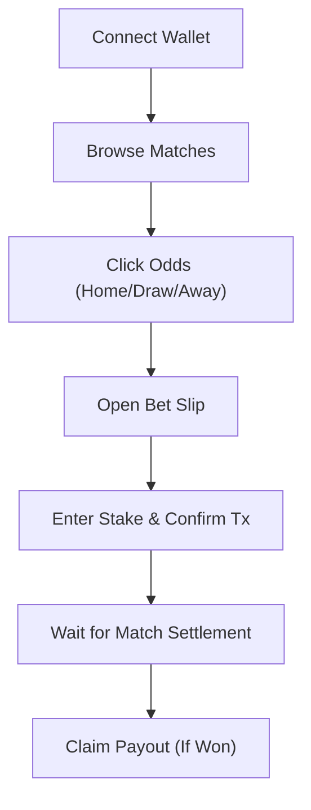

## 1. Product Overview
A decentralized, blockchain-based sports prediction market (sportsbook) built on Initia.
- Users can browse live/upcoming football matches, view dynamic odds set by an oracle, and place bets using a designated token (INIT/umin) on their favorite teams. The House Pool acts as the counterparty for all bets.
- It provides a completely trustless, transparent, and non-custodial betting experience where odds updates and match settlements are cryptographically signed and verified on-chain.

## 2. Core Features

### 2.1 User Roles
| Role | Registration Method | Core Permissions |
|------|---------------------|------------------|
| Bettor | Connect Wallet (InterwovenKit/Initia) | Browse matches, place bets, claim payouts |
| Liquidity Provider (LP) | Connect Wallet (InterwovenKit/Initia) | Deposit liquidity to House Pool, request withdrawals |

### 2.2 Feature Module
1. **Home/Matches Page**: Hero section, live matches list, odds display, bet slip drawer.
2. **Dashboard/Portfolio Page**: Active bets, past bet history, claimable payouts.
3. **Liquidity Pool Page**: LP stats (TVL, utilization), deposit/withdraw forms.

### 2.3 Page Details
| Page Name | Module Name | Feature description |
|-----------|-------------|---------------------|
| Home Page | Hero Banner | Engaging headline, live stats (Total Bets, Pool Size) |
| Home Page | Match List | Grid/List of matches, showing Home/Draw/Away odds buttons |
| Home Page | Bet Slip | Drawer/Sidebar that pops up when an odd is clicked. Enter stake, see potential payout, submit tx. |
| Portfolio | My Bets | Table of Active/Settled bets. Shows "Claim" button for Won bets. |
| Pool Page | LP Interface | Input field to deposit tokens into House Pool. Input field to request LP share withdrawal. |

## 3. Core Process
1. User connects wallet via InterwovenKit.
2. User browses Home Page and clicks on an odd for a specific match.
3. Bet Slip opens; user inputs stake amount.
4. User clicks "Place Bet", signs transaction via wallet.
5. Once match settles, user visits Portfolio and clicks "Claim" on winning slips.

## 4. User Interface Design
### 4.1 Design Style
- **Aesthetic**: Brutalist/Raw combined with modern Web3 elements. Dark mode by default. High contrast.
- **Primary Colors**: Deep Black (`#0a0a0a`), Neon Green (`#00ff66`) for accents/winning states, Stark White (`#ffffff`) for text.
- **Secondary Colors**: Dark Gray (`#1a1a1a`) for cards, Red (`#ff3366`) for losing states/errors.
- **Button Style**: Sharp corners, solid neon backgrounds for primary actions, subtle borders for secondary. Hover states with slight translations (e.g., `translate-x-1 translate-y-1` with hard shadows).
- **Font**: Monospace or geometric sans-serif (e.g., Space Mono, JetBrains Mono, or Syncopate) for numbers/odds to emphasize the technical/trading nature. Inter for body text.
- **Layout**: Grid-heavy, visible borders between sections, dashboard feel.

### 4.2 Page Design Overview
| Page Name | Module Name | UI Elements |
|-----------|-------------|-------------|
| Home | Match Card | Sharp borders, prominent team names, stark buttons for 1X2 odds. |
| Home | Bet Slip | Fixed sidebar on desktop, bottom sheet on mobile. Large typography for stake and payout. |
| Portfolio | Bet History | Dense data table with monospace numbers, colored status badges (Active, Won, Lost). |

### 4.3 Responsiveness
Desktop-first approach. On mobile, the match grid becomes a vertical list, and the bet slip transitions from a persistent sidebar to a sticky bottom action bar that opens a bottom sheet.